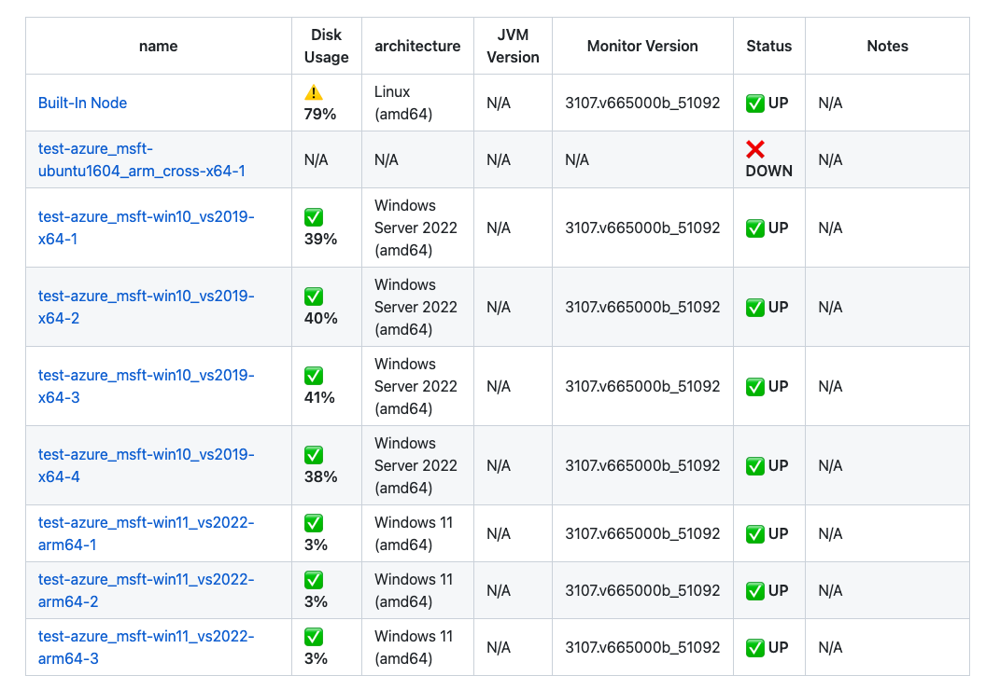
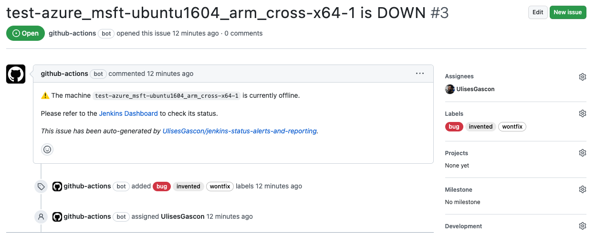

# Jenkins status alerts and reporting

**Create a Github Action that monitors the status of Jenkins and generates Markdown reports for your inventory. It also alerts you when the nodes are not functioning properly.**

## 🔮 About

Let's face it, monitoring the status of Jenkins can be a real headache. If your nodes aren't functioning properly, it can quickly turn into a full-blown migraine. But fear not, dear developers, for there's a new Github Action in town that will save you from the agony of manual monitoring.

Introducing the Github Action that monitors the status of Jenkins and generates Markdown reports for your inventory. This little gem not only keeps an eye on your Jenkins nodes, but it also compiles easy-to-read reports so that you can stay on top of your inventory status with ease.

And if that wasn't enough to make you jump for joy, the Github Action also create issues when it detects that your nodes aren't functioning properly. Now you can sit back, relax, and let this trusty assistant take care of the dirty work for you.

## 📺 Tutorial

_soon_

## ❤️ Awesome Features

- Easy to use with great customization
- Reporting in Markdown with essential information (Disk usage, JVM version...)
- Self-hosted: The reporting data is stored in json format (including previous records) in the repo itself.
- Generate an issue (assignation, labels..) when machines are offline, including links to the Jenkins Dashboard.
- Close the issue when the machine is back online
- Extend the markdown template with you own content by using tags
- Easy to modify the files and ensure the integrity with Json Schemas
- The report data is exported as an output and can be used in the pipeline
- Great test coverage (in progress)

### 🎉 Demo

**Sample Report**



_[Sample report](https://github.com/UlisesGascon/jenkins-status-alerts-and-reporting-demo/blob/main/experimental/jenkins-report.md)_

**Sample Issue**



_[Sample issue](https://github.com/UlisesGascon/jenkins-status-alerts-and-reporting-demo/issues/3)_

## :shipit: Used By

**soon**

- **[More users](https://github.com/UlisesGascon/jenkins-status-alerts-and-reporting/network/dependents)**

## 📡 Usage

### Sample

With this workflow you get them most of this action:

- Trigger manual or by Cron job every Day
- It will generate a detailed report
- It will store the database in the repo
- It will generate an issue per machine that is down
- It will close the issue if the machine is back online

```yml
name: 'Jenkins Monitoring'
on:
  # Scheduled trigger
  schedule:
    # Run every Day at 00:00
    - cron: '0 0 * * *'
  # Manual trigger
  workflow_dispatch:

permissions:
  # Write access in order to update the local files with the reports
  contents: write
  pull-requests: none
  # Write access in order to create issues
  issues: write
  packages: none

jobs:
  jenkins-status:
    runs-on: ubuntu-latest
    steps:
      - uses: actions/checkout@v2
      - name: Jenkins status alerts and reporting
        uses: UlisesGascon/jenkins-status-alerts-and-reporting@v1.3.0
        id: jenkins-status-alerts-and-reporting
        with:
          database: experimental/database.json
          jenkins-domain: 'jenkins.example.com'
          jenkins-username: ${{ secrets.JENKINS_USERNAME }}
          jenkins-token: ${{ secrets.JENKINS_TOKEN }}
          # Issues
          generate-issue: true
          issue-assignees: 'UlisesGascon'
          issue-labels: 'incident,machine-down'
          auto-close-issue: true
          disk-alert-level: 90
          # Report
          report: experimental/jenkins-report.md
          report-tags-enabled: true
          # Git changes
          auto-commit: true
          auto-push: true
          github-token: ${{ secrets.GITHUB_TOKEN }}
```

### Options

- `jenkins-domain`: The domain name of your Jenkins server without the protocol or trailing slash, like `jenkins.example.com`
- `jenkins-username`: The username of the Jenkins user
- `jenkins-token`: The API token of the Jenkins user
- `database`: Defines the path to the json file usage to store the nodes information
- `report`: Defines the path where the markdown report will be added/updated
- `auto-commit`: Commits the changes in the `database` and `report` files
- `auto-push`: Pushes the code changes to the branch
- `generate-issue`: Create an issue per machine that is down
- `issue-assignees`: List of assignees for the issue
- `issue-labels`: List of labels for the issue
- `auto-close-issue`: Close the issue when the machine is back online
- `github-token`: The token usage to create the issue and push the code
- `report-tags-enabled`: Defines if the markdown report must be created/updated around tags by default is disabled. This is useful if the report is going to be include in a file that has other content on it, like docusaurus docs site or similar.
- `report-start-tag`: Defines the start tag, default `<!-- JENKINS-REPORTING:START -->`
- `report-end-tag` Defines the closing tag, default `<!-- JENKINS-REPORTING:END -->`
- `create-issues-for-new-offline-nodes`: Automatically generate an issue if the node is offline and has not been previously recorded in the database
- `disk-alert-level`: Disk usage level to generate an alert

### Outputs

- `computers`: The list of Jenkins computers with all the details (same as the database content)

```yml
name: 'OpenSSF Scoring'
on:
  # ...

permissions:
  # ...

jobs:
  jenkins-status:
    runs-on: ubuntu-latest
    steps:
      - uses: actions/checkout@v2
      - name: Jenkins status alerts and reporting
        uses: UlisesGascon/jenkins-status-alerts-and-reporting@v1.3.0
        id: jenkins-status
        with:
          # ....
      - name: Print the Computers
        run: |
          echo '${{ steps.jenkins-status.outputs.computers }}'
```

## 🚀 Advance Tips

### Avoid creating issues for machines that are already down

If you want to avoid creating issues for the machines that are already down in your infra on the first run, use `create-issues-for-new-offline-nodes=false`

### Embed Report version

If you want to mix the report in markdown format with other content, then you can use `report-tags-enabled=true` then report file will use the tags to add/update the report summary without affecting what is before or after the tagged section.

This is very useful for static websites.

### Custom tags

By default we use `<!-- JENKINS-REPORTING:START -->` and `<!-- JENKINS-REPORTING:END -->`, but this can be customize by adding your custom tags as `report-start-tag` and `report-end-tag`

## 🍿 Other

### Database structure

Just for reference, the database will store the current Jenkins nodes in this shape:

```json
{
  "test-azure_msft-ubuntu1604_arm_cross-x64-1": {
    "name": "test-azure_msft-ubuntu1604_arm_cross-x64-1",
    "description": "Ubuntu 16.04 LTS with Raspberry Pi cross compilers installed",
    "diskUsage": null,
    "architecture": null,
    "monitorVersion": null,
    "isOffline": true,
    "isTemporarilyOffline": false,
    "offlineCauseReason": "",
    "isIdle": true
  }
}
```
